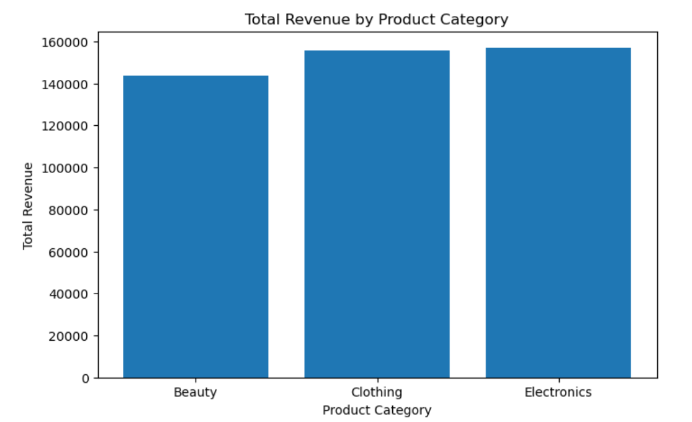
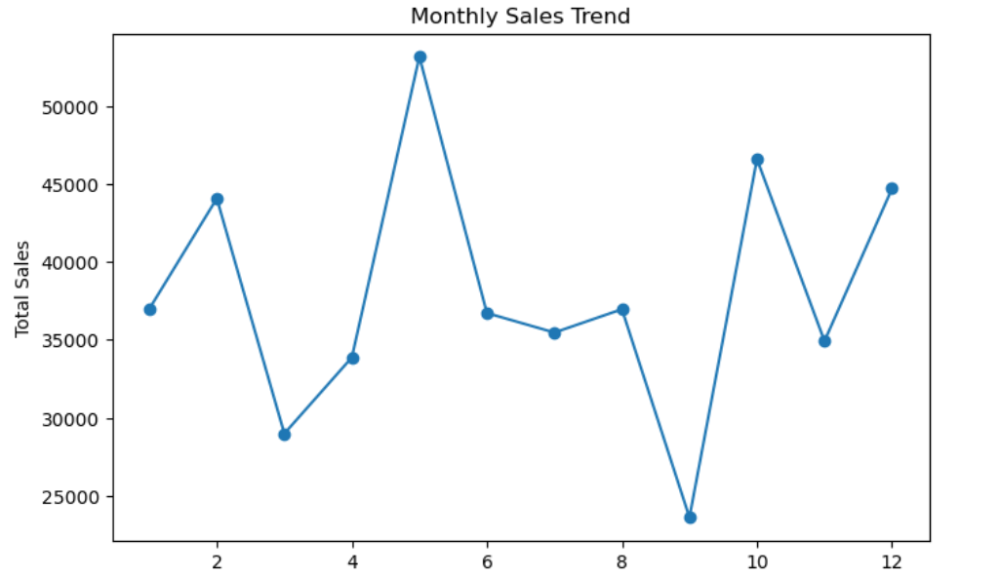
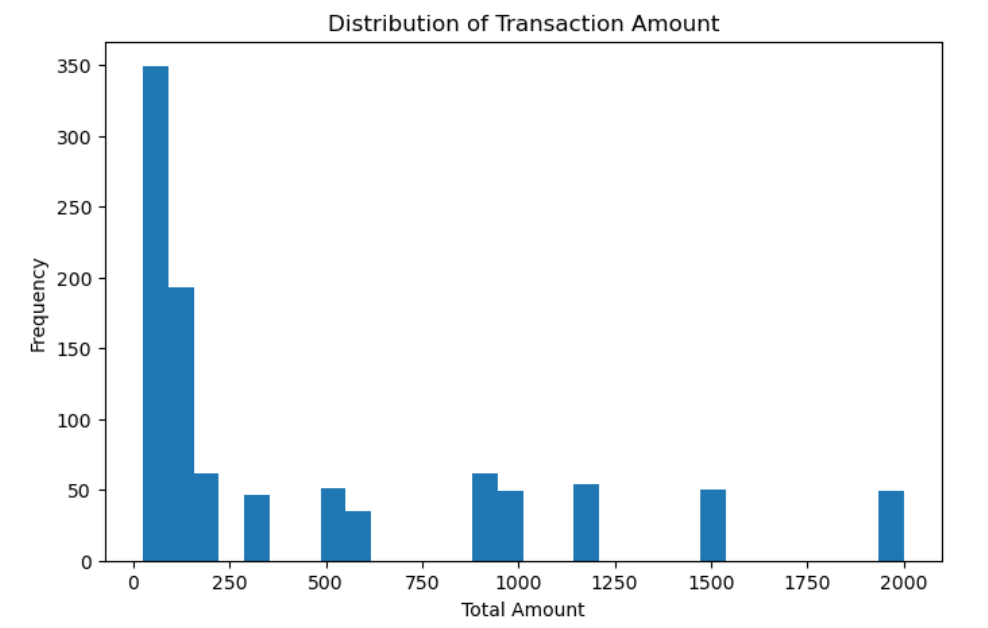
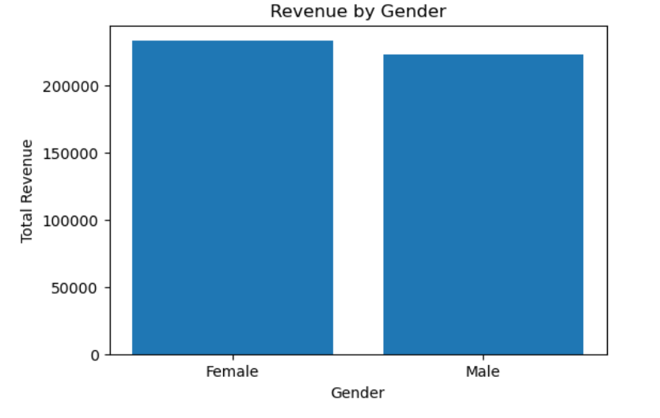
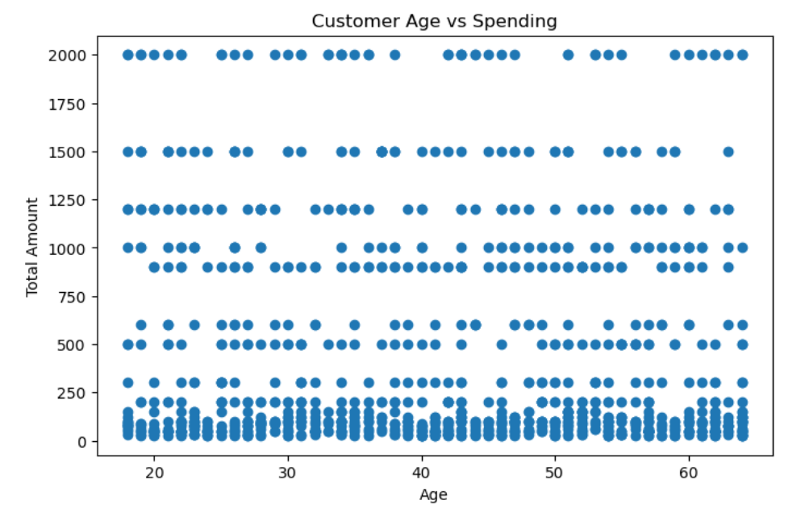
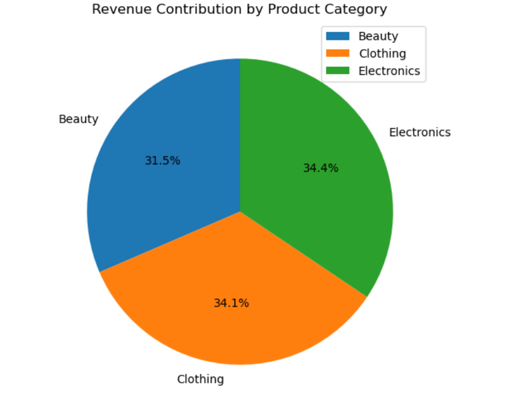
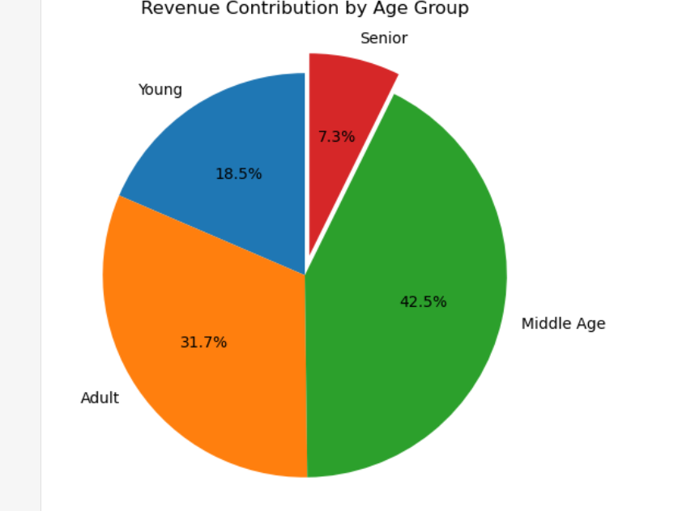
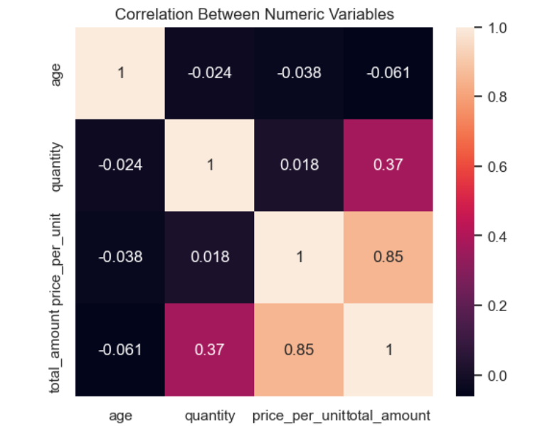
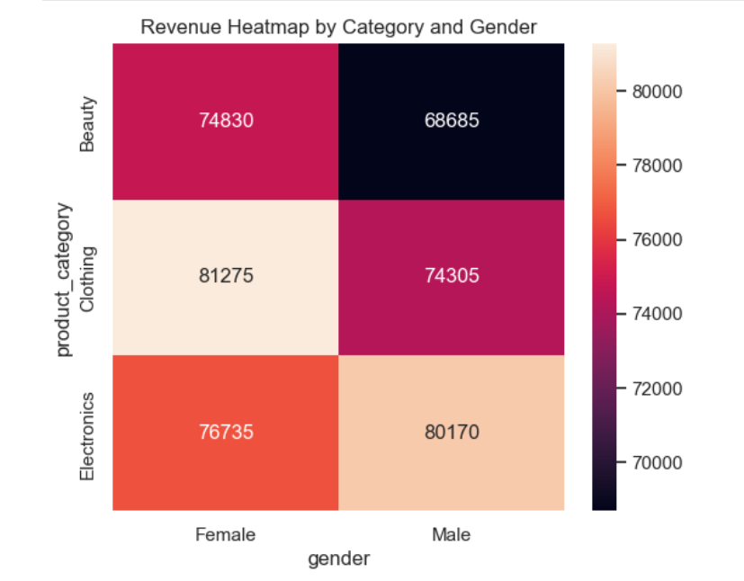
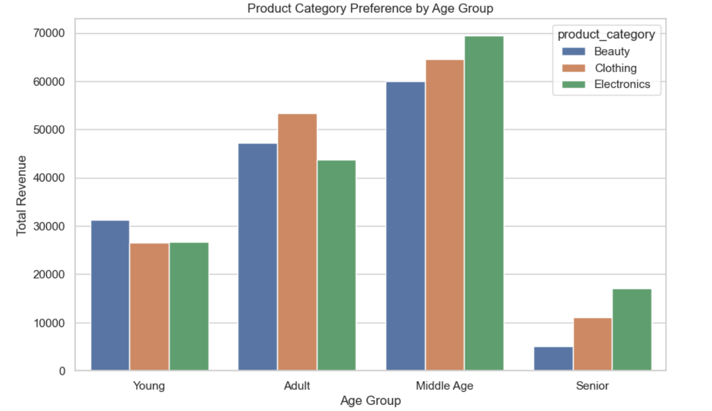

# 🛒 Retail Sales Data Analysis

---

# 📌 Project Description

This project analyzes a **retail sales dataset** to extract meaningful business insights related to:

### 📊 Key Analysis Areas

• Customer purchasing behavior<br>
• Product category performance<br>
• Sales trends<br>

---

The project demonstrates an **end-to-end data analytics workflow**, including:

### ⚙️ Data Analytics Workflow

• Data cleaning and preprocessing using **Python (Pandas)** <br>
• Exploratory Data Analysis (**EDA**)<br>
• Data visualization using **Matplotlib**<br>
• Loading data into **MySQL using SQLAlchemy**<br>
• Writing **SQL queries to answer business questions**<br>
• Extracting **actionable business insights**<br>

---

# 🎯 Objective

The goal of this project is to simulate how a **Data Analyst helps businesses make data-driven decisions** using transactional sales data.

---

# 🛠 Tools & Technologies Used

### 🧰 Programming & Analysis Tools

• 🐍 Python<br>
• 🐼 Pandas<br>
• 🔢 NumPy<br>

### 📊 Data Visualization

• 📈 Matplotlib<br>
• 📊 Seaborn<br>

### 🗄 Database & Data Engineering

• 🗃 MySQL<br>
• 🔗 SQLAlchemy<br>

### 💻 Development Environment

• 📓 Jupyter Notebook<br>

---

# 📂 Dataset Description

The dataset contains **retail sales transactions** with the following information:

### 🧾 Dataset Fields

• Customer ID<br>
• Age<br>
• Gender<br>
• Product Category<br>
• Quantity Purchased<br>
• Price Per Unit<br>
• Total Purchase Amount<br>
• Transaction Date<br>

---

### 📊 This data allows analysis of:

• Customer demographics<br>
• Product performance<br>
• Purchasing patterns<br>
• Revenue trends<br>

---

# 🔄 Project Workflow

---

# 1️⃣ Data Cleaning (Python)

Data cleaning was performed using **Pandas** to prepare the dataset for analysis.

### 🧹 Steps Performed

• Loaded dataset using **Pandas**<br>
• Checked dataset structure and column data types<br>
• Handled missing values<br>
• Removed duplicate records<br>
• Converted date column to **datetime format**<br>

---

### ⚙️ Feature Engineering

New features created:

• transaction_month<br>
• transaction_year<br>

---

### 🔍 Data Quality Checks

• Outlier detection using the **IQR method**<br>
• Performed **Exploratory Data Analysis (EDA)**<br>

---

# 2️⃣ Exploratory Data Analysis

EDA was conducted to understand:

### 📊 Analytical Focus Areas

• Sales distribution<br>
• Product category performance<br>
• Customer demographics<br>
• Revenue patterns<br>

---

# 3️⃣ Data Visualization

Matplotlib was used to visualize patterns in the dataset.

### 📈 Visualizations Help Identify

• Customer spending behavior<br>
• Category performance<br>
• Sales trends<br>


<br><br>
# 📊 Data Visualizations & Insights using Matplotlib

---

# 📊 Total Revenue by Product Category


## 🔎 Business Insight

This chart shows the **total revenue generated by each product category**.

### 📌 Key Observations

• Electronics generates the highest revenue (~157K).<br>
• Clothing follows closely (~156K).<br>
• Beauty generates slightly lower revenue (~144K) compared to other categories.<br>
• Revenue is fairly balanced across all categories, indicating diversified product demand.<br>

### 💡 Business Implications

• Electronics products likely have higher price points, contributing more revenue per sale.<br>
• Clothing products may generate revenue through higher purchase frequency.<br>

### 🏪 Businesses Should

• Maintain strong inventory for electronics.<br>
• Promote clothing through seasonal campaigns.<br>
• Bundle beauty products with clothing promotions.<br>

---

# 📈 Monthly Sales Trend


## 🔎 Business Insight

This chart shows **how total sales vary across different months**.

### 📌 Key Observations

• May has the highest sales (~53K).<br>
• October and December also show strong performance.<br>
• September records the lowest sales (~23K).<br>
• Sales fluctuate across the year, suggesting seasonal demand patterns.<br>

### 💡 Business Implications

• Retailers should increase inventory before high-demand months like May and October.<br>
• Promotions or discounts could boost sales during slower months like September.<br>
• Seasonal campaigns and holiday sales can maximize revenue during peak months.<br>

---

# 📊 Distribution of Transaction Amount


## 🔎 Business Insight

This histogram shows the **distribution of customer transaction values**.

### 📌 Key Observations

• Most purchases fall in the lower transaction range (below 200).<br>
• A smaller number of transactions fall in higher value ranges (500–2000).<br>
• The distribution is right-skewed, meaning many small purchases and fewer high-value purchases.<br>

### 💡 Business Implications

• Retailers rely on frequent smaller purchases for steady revenue.<br>
• Encouraging bundle offers or upselling strategies can increase average transaction value.<br>
• High-value purchases may be linked to electronics products.<br>

---

# 📊 Revenue by Gender


## 🔎 Business Insight

This chart compares **total revenue generated by male and female customers**.

### 📌 Key Observations

• Female customers generate slightly higher revenue (~232K).<br>
• Male customers contribute a similar but slightly lower amount (~223K).<br>
• Both genders contribute significantly to overall revenue.<br>

### 💡 Business Implications

• Marketing strategies should target both genders equally.<br>
• Female customers may respond well to clothing and beauty promotions.<br>
• Male customers may show stronger interest in electronics products.<br>

---

# 📊 Customer Age vs Spending


## 🔎 Business Insight

This scatter plot shows the **relationship between customer age and total spending**.

### 📌 Key Observations

• Spending occurs across all age groups from 18 to 65.<br>
• There is no strong linear relationship between age and spending amount.<br>
• However, middle-aged customers appear frequently among higher-value purchases.<br>

### 💡 Business Implications

• Spending behavior is not strongly dependent on age alone.<br>
• Businesses should focus on customer preferences and product interest rather than just age segmentation.<br>
• Middle-aged customers remain an important revenue-driving segment.<br>

---

# 📊 Revenue Contribution by Product Category

## 🔎 Business Insight

This pie chart shows the **percentage contribution of each product category to total revenue**.

### 📌 Key Observations

• Electronics contributes the largest share (~34.4%).<br>
• Clothing contributes ~34.1%.<br>
• Beauty contributes ~31.5%.<br>
• Revenue contribution is relatively balanced across categories.<br>

### 💡 Business Implications

• The business has a diversified revenue structure, reducing dependence on a single category.<br>
• Retailers can increase revenue by improving marketing for electronics and clothing.<br>
• Balanced category performance indicates healthy product portfolio management.<br>

---

# 📊 Customer Distribution by Gender
![Customer Distribution by Gender (images/customer_distribution_by_gender.png)

## 🔎 Business Insight

This chart shows the **distribution of customers by gender**.

### 📌 Key Observations

• Female customers make up about 51% of the customer base.<br>
• Male customers represent about 49%.<br>
• The customer base is almost evenly distributed between genders.<br>

### 💡 Business Implications

• Marketing campaigns should be inclusive and balanced for both genders.<br>
• Retailers can design gender-specific promotions to increase engagement.<br>
• Product assortment should cater to both male and female customer preferences.<br>

---

# 📊 Revenue Contribution by Age Group

## 🔎 Business Insight

This pie chart shows **how different age groups contribute to total revenue**.

### 📌 Key Observations

• Middle-aged customers contribute the largest share (~42.5%).<br>
• Adult customers contribute ~31.7%.<br>
• Young customers contribute ~18.5%.<br>
• Senior customers contribute the least (~7.3%).<br>

### 💡 Business Implications

• The 41–60 age group is the most valuable customer segment.<br>
• Businesses should prioritize marketing campaigns targeting middle-aged professionals.<br>
• Younger customers can be targeted with affordable products and promotions.<br>
• Seniors represent a smaller but still important niche market.<br>


<br><br>

# 📊 Data Visualizations & Insights using Seaborn

---

# 📊 Correlation Between Numeric Variables


## 🔎 Business Insight

This heatmap shows the **correlation between key numeric variables** such as:

• Age<br>
• Quantity Purchased<br>
• Price Per Unit<br>
• Total Transaction Amount<br>

---

### 📌 Key Observations

• **Price per Unit and Total Amount (0.85 correlation)** show a very strong positive relationship.<br>

• **Quantity and Total Amount (0.37 correlation)** show a moderate positive relationship.<br>

• **Age has very weak correlation with spending**, indicating that purchase amount is not strongly dependent on customer age.<br>

---

### 💡 Business Implications

• Product pricing significantly impacts revenue, meaning higher-value products drive larger transactions.<br>

• Increasing average product price or promoting premium products can boost revenue.<br>

• Marketing strategies should focus on **product value rather than age-based spending assumptions**.<br>

---

# 📊 Revenue Heatmap by Product Category and Gender


## 🔎 Business Insight

This heatmap visualizes **revenue contribution by gender across different product categories**, helping identify purchasing patterns among male and female customers.

---

### 📌 Key Observations

• **Clothing generates the highest revenue from female customers (81,275).** <br>

• **Electronics generates the highest revenue from male customers (80,170).** <br>

• Beauty products show strong revenue from female customers, but lower compared to clothing.<br>

• Male customers still contribute significant revenue across all categories.<br>

---

### 💡 Business Implications

• Female customers show stronger engagement with clothing products, indicating an opportunity for **targeted promotions**.<br>

• Male customers prefer electronics, suggesting marketing campaigns should highlight **technology products** to this segment.<br>

• Businesses can implement **gender-specific marketing strategies** to increase sales.<br>

---

# 📊 Product Category Preference by Age Group


## 🔎 Business Insight

This chart shows how **product category preferences vary across different customer age groups**.

---

### 📌 Key Observations

• **Middle-aged customers generate the highest revenue across all categories**, especially electronics.<br>

• Adult customers show strong spending in clothing, making it one of the most popular categories for this segment.<br>

• Young customers contribute moderate revenue, particularly in beauty products.<br>

• Senior customers contribute the least revenue, but show relatively higher interest in electronics.<br>

---

### 💡 Business Implications

• The **41–60 age group represents the most valuable customer segment**, contributing the highest revenue.<br>

• Marketing strategies should prioritize **middle-aged professionals**, as they drive the majority of sales.<br>

• Younger customers can be targeted with **affordable beauty and lifestyle products**.<br>

• Electronics marketing could be expanded for **both middle-aged and senior customers**.<br>


<br><br>
# 📊 Retail Sales Analysis – Extract Business Insights using MySQL

---

# 1️⃣ Total Revenue Generated

**Total Revenue:** **456,000**

## 🔎 Insight

• The retail store generated **456,000 in total revenue**, representing the overall financial performance of the business.<br>

This metric serves as a **primary KPI used to evaluate:**

• Category performance<br>
• Customer spending patterns<br>
• Seasonal trends<br>

---

# 2️⃣ Revenue by Product Category

| Category    | Revenue |
| ----------- | ------- |
| Electronics | 156,905 |
| Clothing    | 155,580 |
| Beauty      | 143,515 |

## 🔎 Insight

• Electronics generates the highest revenue<br>
• Clothing performs strongly through high purchase frequency<br>
• Beauty contributes a slightly smaller portion<br>

This balanced distribution indicates a **diversified product portfolio**.

---

# 3️⃣ Top Spending Customers

Highest spending customers spent **2,000 each**.

## 🔎 Insight

• Revenue is distributed across many customers, indicating a **stable and diversified customer base**.<br>

Businesses could introduce:

• Loyalty programs<br>
• VIP memberships<br>
• Personalized offers<br>

---

# 4️⃣ Monthly Sales Trend

| Month     | Sales  |
| --------- | ------ |
| January   | 36,980 |
| February  | 44,060 |
| March     | 28,990 |
| April     | 33,870 |
| May       | 53,150 |
| June      | 36,715 |
| July      | 35,465 |
| August    | 36,960 |
| September | 23,620 |
| October   | 46,580 |
| November  | 34,920 |
| December  | 44,690 |

## 🔎 Insight

• May is the **highest performing month**<br>
• September has the **lowest sales**<br>

Retailers should run **promotions during slower months**.

---

# 5️⃣ Revenue by Gender

| Gender | Revenue |
| ------ | ------- |
| Male   | 223,160 |
| Female | 232,840 |

## 🔎 Insight

• Female customers generate slightly higher revenue than male customers.<br>

This suggests **strong purchasing activity among female shoppers**.

---

# 6️⃣ Units Sold by Category

| Category    | Units Sold |
| ----------- | ---------- |
| Clothing    | 894        |
| Electronics | 849        |
| Beauty      | 771        |

## 🔎 Insight

• Clothing is the **most frequently purchased category**, suggesting it contains affordable everyday products.<br>

---

# 7️⃣ Quantity vs Revenue Analysis

| Category    | Units Sold | Revenue |
| ----------- | ---------- | ------- |
| Electronics | 849        | 156,905 |
| Clothing    | 894        | 155,580 |
| Beauty      | 771        | 143,515 |

## 🔎 Insight

• Electronics generates the **highest revenue**<br>
• Clothing sells the **highest number of units**<br>

This indicates **electronics products have higher prices**.

---

# 8️⃣ Gender Product Preferences

## 👨 Male Customers

• Electronics → 80,170<br>
• Clothing → 74,305<br>
• Beauty → 68,685<br>

## 👩 Female Customers

• Clothing → 81,275<br>
• Electronics → 76,735<br>
• Beauty → 74,830<br>

## 🔎 Insight

• Men prefer **electronics**<br>
• Women prefer **clothing**<br>

---

# 9️⃣ Revenue by Age Group

| Age Group  | Revenue |
| ---------- | ------- |
| Middle Age | 193,880 |
| Adult      | 154,245 |
| Young      | 74,650  |
| Senior     | 33,225  |

## 🔎 Insight

• Customers aged **41–60 generate the highest revenue**.<br>

---

# 🔟 Product Preferences by Age Group

## Middle Age

• Electronics → 69,420<br>
• Clothing → 64,530<br>
• Beauty → 59,930<br>

## Adult

• Clothing → 57,760<br>

## Young

• Beauty → 28,905<br>

## Senior

• Electronics → 17,045<br>

## 🔎 Insight

Different age groups prefer **different product categories**, highlighting the importance of **targeted marketing**.

---

# 1️⃣1️⃣ Customer Ranking Analysis

Top spending customers = **2,000**

## 🔎 Insight

• Spending is evenly distributed across many customers, indicating **strong customer engagement**.<br>

---

# 1️⃣2️⃣ Best Category per Age Group

| Age Group  | Best Category |
| ---------- | ------------- |
| Adult      | Clothing      |
| Middle Age | Electronics   |
| Young      | Beauty        |
| Senior     | Electronics   |

---

# 1️⃣3️⃣ Revenue Contribution

| Category    | Revenue Share |
| ----------- | ------------- |
| Electronics | 34.41%        |
| Clothing    | 34.12%        |
| Beauty      | 31.47%        |

## 🔎 Insight

• Revenue distribution is **balanced across categories**.

---

# 1️⃣4️⃣ Category Performance by Age

• Middle-aged customers generate the **highest revenue across categories**.

---

# 1️⃣5️⃣ Demographic Revenue Drivers

The **Middle Age group drives the highest revenue in:**

• Electronics<br>
• Clothing<br>
• Beauty<br>

---

# 1️⃣6️⃣ Monthly Category Trends

### Best Month by Category

• Electronics → May<br>
• Clothing → May<br>
• Beauty → July<br>

## 🔎 Insight

• May is the **strongest sales month**, indicating seasonal demand spikes.

---

# 🧩 Skills Demonstrated

• Data Cleaning with Pandas<br>
• Exploratory Data Analysis<br>
• Data Visualization with Matplotlib & Seaborn<br>
• SQL Query Writing<br>
• Window Functions<br>
• Customer Segmentation<br>
• Business Insight Generation<br>

---

# 📁 Project Structure

```text
retail-sales-data-analysis
│
├── dataset
│   └── retail_sales_dataset.csv
│
├── notebooks
│   └── datacleaning_eda.ipynb
│
├── sql
│   └── sales_analysis.sql
│
├── images
│   └── charts
│
└── README.md
```

---

# 👨‍💻 Author

**Shravan Kulal**
Aspiring Data Analyst

🔗 LinkedIn
https://www.linkedin.com/in/shravan-kulal-analytic997240

📧 Email
[shravan.analytics9972@gmail.com](mailto:shravan.analytics9972@gmail.com)
